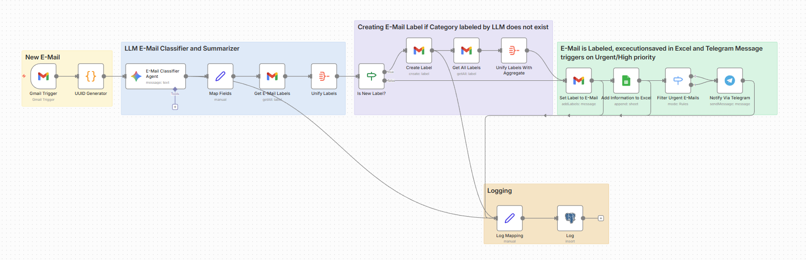
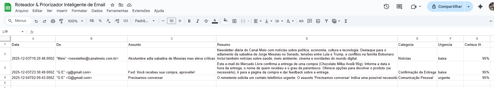
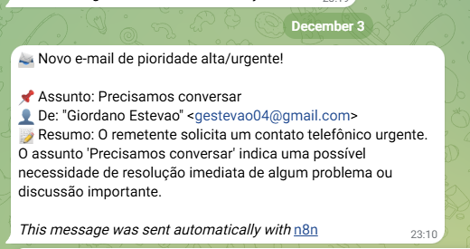

# 🤖 Portfólio de Automações com IA (n8n + LLM)

Este repositório reúne automações
criadas para demonstrar domínio em:
- Integração n8n (iPaaS)
- Modelos de linguagem (Gemini)
- Design de fluxos com IA
- Validação, parsing e tratamento de erros
- Conexões com Google Sheets, Gmail e APIs externas

Cada automação inclui:
- Resumo do caso de uso
- Prints do fluxo
- JSON de exportação
- Explicação técnica do funcionamento

---

## 📌 1. Classificação Automática de Leads (IA + Retry)

### 🎯 Objetivo
Classificar leads automaticamente como **alta**, **média** ou **baixa** prioridade com base na descrição fornecida.

### 🧩 Tecnologias
- n8n
- Google Gemini 2.0 Flash
- Google Sheets
- Gmail

### 🖼 Prints

---

### 🧠 Explicação Técnica
- Trigger captura nova linha no Google Sheets.
- Node de IA classifica o lead retornando JSON estrito (`prioridade`, `motivo`).
- Código faz parsing seguro e validação rigorosa (tipos, campos obrigatórios).
- Em caso de erro, uma **retentativa** é acionada com prompt mais restritivo.
- Se ambas falharem, um email é enviado; senão, a linha é atualizada na planilha.

---

### 🧾 JSON Exportado
[Auto-Classification Workflow.json](workflows/Auto-Classification%20Workflow.json)

---

## 📌 2. AI Ticket Intake

### 🎯 Objetivo
Classificar, resumir e gerar uma resposta inicial automática para tickets enviados via webhook, garantindo consistência, validação rigorosa e retentativas inteligentes quando o modelo retorna dados inválidos.

### 🧩 Tecnologias
- n8n
- Webhook Trigger
- Google Gemini 2.0 Flash
- PostgreSQL
- Gmail
- JavaScript

### 🖼 Prints

---

### 🧠 Explicação Técnica
- Webhook recebe o ticket com `title`, `description` e `customer_id`.
- Campos são normalizados para uso consistente entre todos os LLMs.
- Três modelos Gemini atuam separadamente:
    - **Classificação:** categoria + urgência (JSON estrito)
    - **Resumo:** frase curta para dashboards internos
    - **Resposta sugestiva:** mensagem inicial para o cliente
- Node de código faz **parsing e validação** da classificação:
    - checa JSON, tipos, campos obrigatórios
    - aplica **retentativas automáticas** (até 3x)
    - em falha final, envia alerta por email
- Resultados consolidados e logs são persistidos no PostgreSQL para uso interno.

---

### 🧾 JSON Exportado
[AI Ticket Intake Workflow.json](workflows/AI%20Ticket%20Intake%20Workflow.json)

## 📌 3. Revenue Ops Automation

### 🎯 Objetivo
Automatizar o intake e tratamento de oportunidades (deals) usando IA, garantindo **validação de dados**, **enriquecimento com Gemini**, **classificação automática**, criação de **next steps**, geração de **KPIs** e **notificações inteligentes** no Telegram.

### 🧩 Tecnologias
- n8n
- Schedule Trigger
- HTTP Request (JSON Mapping)
- Google Gemini 2.0 Flash
- PostgreSQL
- Google Sheets
- Gmail
- JavaScript
- Telegram

### 🖼 Prints

---

### 🧠 Explicação Técnica
- Trigger recebe deals via **Webhook** e transforma cada item do array em **execuções independentes** (Split in Batches / Item Lists).
- Função JS valida dados obrigatórios: `amount`, `description`, `close_date`, `stage`.
- Campos inválidos viram um array `missing_fields` e influenciam o fluxo (normal vs. missing data).
- IA gera um resumo estruturado (`ai_summary`), prioridade, classificação e next steps, com **validação rigorosa de JSON**.
- Fluxo implementa **retentativas**, se a IA retornar valores inválidos ou fora do schema.
- Writes no Google Sheets criam uma linha consolidada com timestamps, dados originais, enriquecimento e erros.
- Telegram envia dois tipos de mensagens:
  - Deals válidos → mensagem padrão
  - Deals com problemas → alerta destacando quais campos estão faltando
- Logs de auditoria são gerados em nova aba da planilha, com `uuid`, status, etapa e payload de erro.

---

### 🧾 JSON Exportado
[Revenue Ops Automation Workflow.json](workflows/Revenue%20Ops%20Automation%20Workflow.json)

## 📌 4. Governança & Controle de Custos

### 🎯 Objetivo

Criar um serviço interno que garanta **transparência de uso**, **controle de acesso** e **monitoramento de custos** em fluxos de automação com IA.  
O projeto simula exatamente o tipo de governança exigido em plataformas internas de IA em grandes empresas:
- acesso seguro
- auditoria centralizada
- observabilidade
- rastreabilidade de custos
- alertas automáticos
- relatórios consolidados

---

### 🧩 Tecnologias

- Spring Boot (Kotlin)
- SQLite
- JSON Logging
- API Key Interceptor
- Telegram
- Google Sheets API
- n8n
- PostgreSQL

---

### 🖼 Screenshots

---

### 🧠 Explicação Técnica

Este backend expõe um endpoint `/v1/process` protegido por um interceptor de chave de API personalizado.

Cada requisição é:

1. **Autenticada** — validada em relação a uma lista de chaves de API permitidas
2. **Registrada** — usando logs estruturados em formato JSON com IDs de correlação
3. **Monitorada** — erros acionam alertas de webhook do Telegram com contexto completo
4. **Rastreada** — os metadados da requisição (timestamp, usuário, endpoint, nome do modelo, tokens, custo) são adicionados a um registro de custos do Google Sheets
5. **Resumida** — uma automação n8n pode executar um resumo diário gerando:
   - custo total por modelo
   - número de requisições por chave de API
   - taxa de erros
   - variações semanais

Isso combina governança, observabilidade, conformidade e FinOps — exatamente o que as equipes de plataformas de IA precisam.

---

### 🧾 JSON Exportado
[Governance & Cost Control Workflow.json](workflows/Governance%20%26%20Cost%20Control%20Workflow.json)

---

### 🔗 Link para o Projeto Kotlin
[Kotlin Project](https://github.com/gestevao04/governance-backend)

## 📌 5. Classificador & Priorizador Inteligente de E-mail

### 🎯 Objetivo
Automatizar a triagem, classificação e priorização de e-mails recebidos, reduzindo esforço manual e garantindo que mensagens importantes recebam atenção imediata.  
O fluxo identifica automaticamente a categoria de cada e-mail, avalia urgência, aplica a label correta no Gmail e registra tudo em uma planilha para auditoria.  
Além disso, a automação cria labels inexistentes e mantém um histórico organizado e rastreável.

---
### 🧩 Tecnologias
- n8n
- Google Gmail API
- Gemini 2.0 Flash
- Google Sheets API
- JavaScript Expressions
- OAuth 2.0 (Google)
- Telegram
- PostgreSQL

---
### 🖼 Screenshots

---

### 🧠 Explicação Técnica

O fluxo é desencadeado por um **Gmail Trigger**, que captura e-mails não lidos recebidos recentemente.  
Cada mensagem segue o pipeline:

1. **Leitura do e-mail**  
   O n8n obtém remetente, assunto e corpo completo da mensagem.

2. **Classificação via IA**  
   O conteúdo é enviado ao modelo **Gemini Flash 2.0**, que retorna um JSON com:
    - categoria sugerida
    - urgência (baixa, média, alta)
    - resumo em 1 parágrafo
    - grau de confiança

3. **Mapeamento e Normalização**  
   Os campos retornados pela IA são organizados e preparados para os próximos passos.

4. **Verificação de Labels**  
   O fluxo compara a categoria sugerida com as labels existentes no Gmail:
    - Se a label já existir → segue
    - Se não existir → uma nova label é criada automaticamente

5. **Aplicação da Label**  
   A mensagem recebe sua categoria como label, mantendo a caixa de entrada sempre organizada.

6. **Registro no Google Sheets**  
   Todo processamento é gravado em uma planilha contendo:
    - data
    - de
    - assunto
    - categoria
    - urgência
    - resumo
    - confiança  
      Esse registro funciona como um **histórico auditável** e permite dashboards externos.

O resultado é um sistema autônomo capaz de organizar e priorizar sua caixa de entrada de forma inteligente e consistente.

---

### 🧾 JSON Exportado
[Email Classifier & Prioritizer Workflow.json](workflows/Email%20Classifier%20%26%20Prioritizer%20Workflow.json)

---
## 📎 Contato
Se quiser discutir automação com IA, desenho de Workflow ou projetos n8n:

**gestevao04@gmail.com**  
**LinkedIn: https://www.linkedin.com/in/giordanome/?locale=pt**

